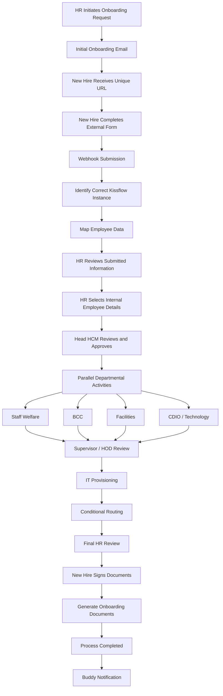

# New Hire Onboarding Process Automation

> **Private Technical Repository**  
> **Organization:** Rex Insurance Limited  
> **Platform:** Kissflow  
> **Project Status:** User Acceptance Testing (UAT) in progress  
> **Production Status:** Not yet deployed

---

## Table of Contents

1. [Project Overview](#1-project-overview)
2. [Business Problem](#2-business-problem)
3. [Project Objectives](#3-project-objectives)
4. [Project Scope](#4-project-scope)
5. [Current Project Status](#5-current-project-status)
6. [Solution Architecture](#6-solution-architecture)
7. [End-to-End Process Flow](#7-end-to-end-process-flow)
8. [Roles and Responsibilities](#8-roles-and-responsibilities)
9. [Workflow Architecture](#9-workflow-architecture)
10. [Dynamic Supervisor / HOD Assignment](#10-dynamic-supervisor--hod-assignment)
11. [Integrations](#11-integrations)
12. [External Onboarding Form](#12-external-onboarding-form)
13. [Process Instance ID and Record Correlation](#13-process-instance-id-and-record-correlation)
14. [Webhook and Data Synchronization](#14-webhook-and-data-synchronization)
15. [Email Automation](#15-email-automation)
16. [Conditional Routing](#16-conditional-routing)
17. [IT Provisioning](#17-it-provisioning)
18. [Document Signing and Generation](#18-document-signing-and-generation)
19. [Permissions and Access Control](#19-permissions-and-access-control)
20. [Audit and Control Design](#20-audit-and-control-design)
21. [User Acceptance Testing](#21-user-acceptance-testing)
22. [Current UAT Focus Areas](#22-current-uat-focus-areas)
23. [Exception Handling](#23-exception-handling)
24. [Production Readiness](#24-production-readiness)
25. [Security and Confidentiality](#25-security-and-confidentiality)
26. [Repository Structure](#26-repository-structure)
27. [Testing and Validation Principles](#27-testing-and-validation-principles)
28. [Future Work](#28-future-work)
29. [My Contribution](#29-my-contribution)
30. [Author](#30-author)
31. [Disclaimer](#31-disclaimer)

---

# 1. Project Overview

The **New Hire Onboarding Process Automation** project is a business process automation solution designed to digitize, coordinate, and control the activities required to onboard a new employee at **Rex Insurance Limited**.

The solution is primarily implemented within the **Human Capital Management application in Kissflow** and integrates an external onboarding portal used by the new employee to provide required personal and employment-related information.

The solution brings together:

- Kissflow workflow automation
- An external onboarding portal
- JavaScript
- Webhooks
- Microsoft Outlook
- Kissflow integrations
- Lookup and reference data
- Role-based workflow assignments
- Formula-based task assignment
- Conditional routing
- IT provisioning activities
- Kissflow document generation
- UAT documentation
- Audit and control documentation

The process is designed to support onboarding from the initial HR request through new-hire information collection, internal review, approval, operational onboarding activities, technology provisioning, document signing, final review, document generation, and completion.

This repository is the **private technical documentation repository** for the project. It is intended to preserve a detailed record of the implementation, design decisions, workflow behavior, testing approach, controls, and production-readiness requirements.

It is not intended to expose sensitive company information, credentials, employee data, secrets, or security-sensitive implementation details.

---

# 2. Business Problem

Employee onboarding is a cross-functional business process involving multiple people, departments, approvals, data sources, and operational activities.

Without structured automation, the process can depend heavily on:

- Manual emails
- Repeated follow-up
- Manual task assignment
- Repeated data entry
- Separate information sources
- Individual staff members remembering when to perform activities
- Manual coordination between HR and operational departments
- Manual identification of the employee's supervisor
- Manual collection and storage of employee documents

The process involves several stakeholders, including:

- HR / HCM
- New Hire
- Head HCM
- Staff Welfare
- BCC
- Facilities
- CDIO / Technology Leadership
- Supervisor / HOD
- IT

The process also requires information collected outside Kissflow to be linked to the correct onboarding request.

This creates several important business and technical challenges:

1. Each employee must receive the correct onboarding link.
2. External employee submissions must update the correct Kissflow process instance.
3. Tasks must be assigned to the appropriate department or approver.
4. The correct supervisor must be identified based on organizational data.
5. Activities that can occur simultaneously should not unnecessarily block each other.
6. Different onboarding scenarios may require different process routes.
7. IT provisioning should occur only after the relevant approvals.
8. Generated onboarding documents must belong to the correct employee request.
9. Employees should receive the correct notifications and dynamic information.
10. The organization needs an auditable record of actions, approvals, integrations, and completion.

The project was designed to address these challenges by combining workflow automation, integration, lookup logic, conditional routing, and document generation within a controlled process.

---

# 3. Project Objectives

The primary objectives of the project are to:

1. Digitize the end-to-end new hire onboarding process.
2. Reduce dependence on manual routing and follow-up.
3. Allow new hires to submit required information through an external onboarding portal.
4. Associate each external form submission with the correct Kissflow onboarding request.
5. Automate employee onboarding emails.
6. Route activities to the appropriate departments and roles.
7. Automatically identify and assign the correct Supervisor / HOD.
8. Support sequential, parallel, and conditional workflow behavior.
9. Coordinate technology access and equipment provisioning.
10. Generate required onboarding documents from approved process data.
11. Maintain traceable workflow and integration histories.
12. Support structured User Acceptance Testing before production deployment.
13. Establish control points for approvals, permissions, data integrity, and segregation of duties.
14. Prepare the solution for eventual production deployment once testing and approval requirements are satisfied.

---

# 4. Project Scope

## 4.1 Included in the Current Implementation

The current solution includes:

- HR onboarding request initiation
- New-hire email capture
- Employee-specific onboarding URL generation
- External onboarding form
- Webhook submission from the external onboarding portal
- Process instance identification
- Employee data synchronization
- HR review of submitted information
- HR selection of internal employment information
- Head HCM review and approval
- Role-based workflow assignments
- Parallel departmental onboarding activities
- Staff Welfare task
- BCC task
- Facilities task
- CDIO / Technology-related task
- Dynamic Supervisor / HOD assignment
- Supervisor access review
- IT provisioning activities
- Office-location conditional routing
- Laptop / equipment conditional routing
- Final HR review
- Employee document signing
- Automated onboarding document generation
- Buddy notification
- UAT documentation
- Audit and control documentation
- Business testing handoff to HR / HCM

## 4.2 Extended Business Process Paths

The source business process also contains additional procurement and payment-related paths involving functions such as:

- Procurement
- ICU
- CFO
- MD
- Payment confirmation

These paths may apply to specific equipment scenarios.

They should **not be described as fully implemented functionality unless implementation evidence or business confirmation explicitly supports that conclusion**.

---

# 5. Current Project Status

The project has not yet been deployed to production.

## 5.1 Completed

| Area | Status |
|---|---|
| Business process analysis | Completed |
| Requirements interpretation | Completed |
| Workflow design | Completed |
| Kissflow workflow configuration | Completed |
| Role assignment | Completed |
| HOD / Supervisor lookup | Completed |
| External onboarding form integration | Completed |
| Webhook data synchronization | Completed |
| Automated email integration | Completed |
| Conditional workflow routing | Completed |
| IT provisioning flow | Completed |
| Document generation configuration | Completed |
| Buddy notification | Completed |
| UAT document preparation | Completed |
| Audit & Control documentation | Completed |
| Handoff to HR / HCM for UAT | Completed |

## 5.2 In Progress

| Area | Status |
|---|---|
| User Acceptance Testing | In Progress |
| Business validation | In Progress |
| Validation of UAT focus areas | In Progress |

## 5.3 Pending

| Area | Status |
|---|---|
| UAT completion | Pending |
| UAT sign-off | Pending |
| Resolution / acceptance of significant defects | Pending |
| Production readiness review | Pending |
| Production change approval | Pending |
| Production deployment | Pending |
| Post-deployment smoke test | Pending |
| Production performance measurement | Pending |

> **Important:** There is currently no valid production performance data.  
> This repository must not claim time savings, percentage improvements, productivity gains, adoption rates, or other production metrics until reliable production data exists.

---

# 6. Solution Architecture

The solution combines Kissflow workflow automation with an external onboarding portal and several supporting integrations.

## 6.1 High-Level Architecture

```text
┌──────────────────────────────┐
│           HR / HCM           │
│ Initiates Onboarding Request │
└──────────────┬───────────────┘
               │
               ▼
┌──────────────────────────────┐
│           Kissflow           │
│ New Hire Onboarding Process  │
│       Process Instance       │
└──────────────┬───────────────┘
               │
               │ Process Instance ID
               ▼
┌──────────────────────────────┐
│    JavaScript Integration    │
│ Generates Employee URL      │
└──────────────┬───────────────┘
               │
               ▼
┌──────────────────────────────┐
│      Microsoft Outlook       │
│ Sends Onboarding Email       │
└──────────────┬───────────────┘
               │
               ▼
┌──────────────────────────────┐
│ External Onboarding Portal   │
│ Multi-Step Employee Form     │
└──────────────┬───────────────┘
               │
               │ Webhook POST
               ▼
┌──────────────────────────────┐
│    Kissflow Integration      │
│ Identifies Process Instance  │
│ Maps Employee Information    │
└──────────────┬───────────────┘
               │
               ▼
┌──────────────────────────────┐
│      Kissflow Workflow       │
│ Reviews / Approvals / Tasks  │
└──────────────┬───────────────┘
               │
               ▼
┌──────────────────────────────┐
│ IT / Document / Notification │
│ Provisioning + Completion    │
└──────────────────────────────┘
```

## 6.2 Main Components

| Component | Purpose |
|---|---|
| Kissflow | Core workflow orchestration |
| External onboarding portal | New-hire information collection |
| JavaScript | Dynamic URL generation and integration logic |
| Webhooks | Transfer employee data back into Kissflow |
| Microsoft Outlook | Automated email notification |
| Kissflow integrations | Process updates, approvals, email, and document generation |
| Lookup / reference data | Organizational mapping and dynamic task assignment |
| Workflow roles | Task ownership and responsibility |
| Conditional routing | Scenario-based workflow behavior |
| Kissflow document templates | Generation of onboarding documents |

---

# 7. End-to-End Process Flow

The implemented core process follows the sequence below.

```text
HR initiates onboarding request
        ↓
Initial onboarding email is generated
        ↓
New hire receives unique onboarding URL
        ↓
New hire completes external onboarding form
        ↓
External form submits data through webhook
        ↓
Correct Kissflow process instance is identified
        ↓
Employee data is mapped into Kissflow
        ↓
Workflow advances to HR
        ↓
HR reviews employee-submitted information
        ↓
HR enters / selects internal employment information
        ↓
Head HCM reviews and approves
        ↓
Parallel departmental onboarding activities begin
        ↓
Staff Welfare / BCC / Facilities / CDIO perform tasks
        ↓
Supervisor / HOD reviews employee roles and access
        ↓
IT performs profile, credential, access and equipment activities
        ↓
Conditional routing occurs where applicable
        ↓
Final HR review
        ↓
New hire signs required onboarding documents
        ↓
Document-generation integration creates onboarding PDFs
        ↓
Process reaches Completed status
        ↓
Buddy-related employee notification is sent
```

## 7.1 Mermaid Flow



---

# 8. Roles and Responsibilities

## 8.1 HR / Requester

HR is responsible for:

- Initiating the onboarding request.
- Providing the new-hire email where required.
- Reviewing synchronized employee information.
- Selecting the employee department.
- Selecting the employee unit.
- Selecting job title.
- Selecting office location.
- Selecting resumption date.
- Selecting employment type.
- Assigning a Buddy.
- Selecting required access.
- Providing applicable equipment specifications.
- Performing final HR review.

## 8.2 New Hire

The new hire is responsible for:

- Receiving the onboarding link.
- Completing the external onboarding form.
- Providing required employee information.
- Reviewing submitted information where applicable.
- Signing required onboarding documents.

## 8.3 Head HCM

Head HCM is responsible for:

- Reviewing HR and employee information.
- Providing concurrence.
- Approving before downstream onboarding activities begin.

## 8.4 Staff Welfare

Staff Welfare is responsible for configured employee profile and welfare-related onboarding activities.

This may include:

- Creating or confirming configured employee profile information.
- Recording approval or signature where configured.

## 8.5 BCC

BCC is responsible for configured onboarding readiness activities such as:

- ID card readiness
- Welcome pack readiness
- Other assigned onboarding items

The exact activity depends on the configured business process.

## 8.6 Facilities

Facilities is responsible for:

- Confirming workstation requirements.
- Confirming facility-related requirements.
- Recording configured approval or completion information.

## 8.7 CDIO / Technology Leadership

CDIO / Technology Leadership is responsible for:

- Reviewing technology requirements.
- Reviewing access requirements.
- Providing technology concurrence where configured.

## 8.8 Supervisor / HOD

The Supervisor / HOD is responsible for:

- Reviewing employee roles.
- Reviewing system access requirements.
- Reviewing permission requirements.
- Approving the employee access profile.

## 8.9 IT

IT is responsible for:

- Creating the employee technology profile.
- Configuring applicable system access.
- Handling relevant credentials.
- Providing or configuring laptop / equipment where applicable.
- Performing technology provisioning activities.

## 8.10 System / Integration

Automated system activities include:

- Generating employee-specific onboarding URLs.
- Sending automated emails.
- Receiving webhook submissions.
- Updating Kissflow process items.
- Advancing configured workflow stages.
- Generating onboarding documents.
- Maintaining integration run history.

---

# 9. Workflow Architecture

The Kissflow workflow uses a combination of:

- Sequential tasks
- Parallel branches
- Conditional branches
- Role-based assignments
- Formula-based assignments
- Approval tasks
- External integrations
- Lookup and reference data
- Automated document generation

## 9.1 Initial Sequence

```text
New Hire Onboarding Process
        ↓
New Hire Provides Information
        ↓
HR Selects New Employee Details
        ↓
Head HCM Concurs and Approves
```

## 9.2 Parallel Activities

After Head HCM approval, several operational tasks can proceed in parallel.

Conceptually:

```text
                      ┌── Staff Welfare
                      │
Head HCM Approval ────┼── BCC
                      │
                      ├── Facilities
                      │
                      └── CDIO / Technology
```

Parallel execution reduces unnecessary dependency between business functions that do not need to wait for one another.

## 9.3 Later Workflow Activities

Later stages include:

- Supervisor / HOD review
- IT provisioning
- Conditional routing
- Final HR review
- New-hire document signing
- Document generation
- Completion
- Buddy notification

---

# 10. Dynamic Supervisor / HOD Assignment

One of the important implementation features is automatic Supervisor / HOD assignment.

Instead of requiring HR to manually choose the employee's supervisor for every onboarding request, the workflow uses a Head of Departments lookup / reference dataset.

## 10.1 Conceptual Logic

```text
Selected New Hire Department
        ↓
Head of Departments Lookup
        ↓
Filter Lookup Using Department
        ↓
Return Matching HOD / Manager
        ↓
Assign Supervisor Task
```

A configured reference can conceptually expose a value similar to:

```text
HOD_Lookup.HODManager
```

The exact internal field names may differ and should not be treated as a public API.

## 10.2 Business Benefit

This configuration:

- Reduces manual supervisor selection.
- Improves consistency.
- Uses maintained organizational reference data.
- Reduces risk of assigning a supervisor task to the wrong manager.
- Supports scalable onboarding as employee volume increases.

## 10.3 UAT Requirements

UAT should confirm:

- Every supported department has a valid HOD mapping.
- The correct HOD is returned.
- The task is assigned to the correct user.
- Missing or invalid mappings are detected.
- The workflow does not silently assign an incorrect HOD.

---

# 11. Integrations

The project contains several Kissflow integrations supporting different stages of the onboarding process.

---

## 11.1 New Hire First Email

### Purpose

Send the new hire their employee-specific onboarding link.

### Trigger

Configured onboarding request submission or appropriate workflow event.

### Actions

1. Run JavaScript.
2. Build an employee-specific onboarding URL.
3. Send the email using Microsoft Outlook.

### Conceptual Flow

```text
Workflow Event
      ↓
Run JavaScript
      ↓
Build Employee URL
      ↓
Microsoft Outlook
      ↓
New Hire Receives Email
```

### Conceptual URL

```text
<ONBOARDING_PORTAL>/new-hire/{instanceId}
```

The real internal test or production domain should not be exposed unnecessarily in the repository.

---

## 11.2 Receive Onboarding Details

### Trigger

Webhook POST from the external onboarding portal.

### Purpose

Synchronize employee-submitted information with the correct Kissflow onboarding request.

### Actions

The integration performs actions conceptually including:

- Receive webhook payload.
- Read the process instance identifier.
- Identify the correct process item.
- Map employee data to configured Kissflow fields.
- Update the process record.
- Advance or approve the configured workflow stage where applicable.

### Key Risk

The most important control is ensuring that one employee's data cannot update another employee's onboarding request.

---

## 11.3 New Hire Request

### Trigger

Configured item-creation event.

### Purpose

Create or update onboarding request information using:

- Process instance identifier
- Employee data
- Mapped workflow values

---

## 11.4 New Hire Onboarding Advance

### Trigger

Configured workflow event.

### Purpose

Programmatically advance configured workflow stages after required prerequisites are satisfied.

The integration may perform a sequence of process update and approval actions.

---

## 11.5 New Hire Onboarding Documents

### Trigger

Configured workflow completion or completion-related event.

### Purpose

Generate configured onboarding documents from Kissflow document templates using approved and signed workflow data.

Current project evidence shows **six configured generated onboarding documents**.

The exact internal templates should not be exposed unless separately approved.

---

## 11.6 New Hire Email Notification / Buddy Notification

### Trigger

Configured approval stage.

### Actions

- Fetch Buddy or reference information.
- Send email using Microsoft Outlook.

### Purpose

Provide Buddy-related information to the employee.

Dynamic values may include:

- Employee name
- Buddy name
- Office context
- Contact information

UAT should verify that:

- No unresolved placeholders remain.
- Correct contact information is displayed.
- Employee and Buddy information belongs to the correct request.

---

# 12. External Onboarding Form

The external onboarding portal contains an **11-step onboarding form**.

It collects structured employee information across several sections.

## 12.1 Information Areas

Examples include:

- Personal information
- Dependents
- Parent / guardian information
- Emergency contact
- Education
- References
- Previous employment
- Payee / banking information
- Beneficiary information

The portal is designed to collect structured information from the employee before internal HR and operational activities continue.

## 12.2 Required-Field Validation

Required fields should prevent incomplete submission of mandatory employee information.

UAT should verify:

- Mandatory fields cannot be bypassed.
- Appropriate validation messages appear.
- The employee cannot complete the form with missing required data.

## 12.3 Conditional Logic

### Disability

```text
Disability = No
→ Additional description hidden

Disability = Yes
→ Additional information requested
```

### Marital Status

```text
Married
→ Spouse information requested

Other applicable statuses
→ Unnecessary spouse fields hidden
```

### Previous Employment

```text
Previous Employer = No
→ Employer details not required

Previous Employer = Yes
→ Employer details displayed
```

### Beneficiaries

Configured beneficiary allocations should total:

```text
100%
```

This validation should be tested during UAT.

---

# 13. Process Instance ID and Record Correlation

The process instance ID is one of the most important technical components of the architecture.

It acts as the correlation identifier between the Kissflow workflow and the external onboarding experience.

## 13.1 Uses of the Process Instance ID

The instance ID is used to:

- Generate the unique new-hire onboarding link.
- Associate the external form with the correct onboarding request.
- Identify the correct Kissflow process instance.
- Maintain separation between simultaneous onboarding requests.
- Associate emails with the correct request.
- Associate generated documents with the correct employee process.
- Support traceability across system boundaries.

## 13.2 Conceptual Architecture

```text
Kissflow Onboarding Request
          │
          └── Process Instance ID
                    │
                    ├── Dynamic Onboarding URL
                    │
                    ├── External Employee Form
                    │
                    ├── Webhook Payload
                    │
                    ├── Kissflow Process Update
                    │
                    └── Employee Documents
```

## 13.3 Concurrent Request Isolation

Testing should explicitly create multiple simultaneous onboarding requests.

For example:

```text
Employee A → Instance A
Employee B → Instance B
```

Expected behavior:

```text
Employee A submission → updates only Instance A
Employee B submission → updates only Instance B
```

The test should also confirm:

- Emails are not mixed between requests.
- Buddy information is not mixed between requests.
- Generated documents belong to the correct process.
- Retry behavior does not create cross-record changes.

---

# 14. Webhook and Data Synchronization

The external onboarding portal sends employee information to Kissflow through a webhook.

## 14.1 Conceptual Flow

```text
External Form Submission
        ↓
Webhook POST
        ↓
Receive Onboarding Details Integration
        ↓
Read Process Instance Identifier
        ↓
Locate Correct Kissflow Item
        ↓
Map Submitted Fields
        ↓
Update Process Item
        ↓
Advance Configured Workflow Step
```

## 14.2 Mapping Responsibilities

The integration should ensure that:

- The correct process instance is found.
- Employee information maps into the intended fields.
- Required data is not dropped.
- No unrelated employee record is changed.
- Invalid values are handled appropriately.
- Integration errors remain visible for investigation.

## 14.3 Retry and Duplicate Protection

Retries must be tested to ensure they do not create:

- Duplicate process records
- Duplicate tasks
- Duplicate emails
- Duplicate document sets
- Repeated approvals

The final operational retry model should be confirmed before production.

---

# 15. Email Automation

Microsoft Outlook is used for configured onboarding email notifications.

## 15.1 Initial New-Hire Email

```text
Workflow Trigger
      ↓
JavaScript
      ↓
Generate Dynamic Onboarding URL
      ↓
Microsoft Outlook
      ↓
New Hire Receives Onboarding Email
```

The email contains an employee-specific onboarding link.

## 15.2 Buddy Email

```text
Configured Workflow Approval
      ↓
Fetch Buddy / Reference Data
      ↓
Microsoft Outlook
      ↓
Buddy Staff Information Email
```

## 15.3 Email Validation Requirements

UAT should confirm:

- Email is sent to the correct recipient.
- Employee name is correct.
- Dynamic onboarding URL belongs to the correct process instance.
- Buddy name is correct.
- Office context is correct.
- Contact information is correct.
- No placeholder syntax remains visible.
- No information from another employee request appears in the message.

---

# 16. Conditional Routing

The workflow contains conditional routing to support different onboarding scenarios.

## 16.1 Office Location

Certain provisioning behavior may differ between:

```text
Head Office
vs.
Branch Office
```

The exact approved business behavior must be confirmed through UAT and approved requirements before production.

## 16.2 Equipment / Laptop Requirement

Conceptually:

```text
Laptop / Equipment Required?
          │
          ├── Yes → Applicable Provisioning Route
          │
          └── No  → Continue Standard Route
```

## 16.3 Why Conditional Routing Matters

Incorrect routing can cause:

- Required tasks to be skipped.
- Unnecessary tasks to be created.
- Wrong employees or departments to receive tasks.
- Incorrect provisioning behavior.
- Delays during onboarding.

Conditional routes are therefore a major UAT focus area.

---

# 17. IT Provisioning

IT provisioning occurs after the appropriate workflow and technology reviews.

IT activities include:

- Creating the employee technology profile.
- Configuring approved access.
- Handling applicable credentials.
- Handling laptop or equipment provisioning where required.
- Supporting role-based system access.

Technology provisioning should occur only after the required approvals and business information are available.

UAT should verify:

- Correct employee details reach IT.
- Correct access requirements are displayed.
- Correct equipment requirements are displayed.
- Required upstream approvals have occurred.
- Branch / Head Office logic behaves as intended.
- Sensitive credentials are handled securely.

---

# 18. Document Signing and Generation

After the applicable onboarding activities are completed:

1. HR performs final review.
2. The new hire receives or reviews required onboarding documentation.
3. The new hire signs required documents.
4. The configured workflow completion event occurs.
5. Kissflow document-generation integrations create the configured PDF documents.
6. Generated documents are associated with the appropriate onboarding record.
7. The process reaches its configured Completed state.

The current project evidence shows **six configured generated onboarding documents**.

The unrestricted original templates should not be stored in this repository unless explicitly authorized.

## 18.1 Document Generation Controls

Testing should confirm:

- Correct employee information appears in each document.
- Correct signatures are used.
- Correct dates are used.
- Documents correspond to the correct process instance.
- Documents are generated only after appropriate workflow conditions.
- No duplicate document sets are produced during retry scenarios.

---

# 19. Permissions and Access Control

Role and field permissions are part of the control design.

Expected access-control principles include:

- Only authorized HR / HCM users should initiate onboarding requests.
- Users should perform only tasks assigned to their roles.
- Protected fields should not be editable by unauthorized users.
- A user should not be able to approve another role's task without authorization.
- Sensitive employee data should only be visible to appropriate users.
- IT provisioning should occur only after applicable upstream approvals.
- Workflow responsibilities should preserve segregation of duties.

Permissions remain a required UAT and production-readiness validation area.

---

# 20. Audit and Control Design

The project includes dedicated Audit & Control documentation.

The following control areas are important to the solution.

## 20.1 Authorized Initiation

Only appropriate HR / HCM users should be able to create onboarding requests.

## 20.2 Recipient Validation

The employee email used for onboarding communication should be captured correctly.

## 20.3 Unique Process Linkage

Every employee request must remain associated with its own process instance ID.

## 20.4 External Form Validation

Required and conditional form logic should prevent incomplete or invalid submissions.

## 20.5 Webhook Mapping

Employee-submitted information must update:

- The correct Kissflow process instance
- The correct workflow fields

## 20.6 Head HCM Authorization

Downstream onboarding activities should not become available before the required approval.

## 20.7 Segregation of Duties

Separate business functions should perform their assigned responsibilities.

Examples include:

- Staff Welfare
- BCC
- Facilities
- CDIO
- Supervisor
- IT

## 20.8 IT Provisioning Control

Relevant technology approvals should precede technology provisioning.

## 20.9 Final HR Review

HR should review consolidated onboarding activities before completion.

## 20.10 Employee Signatures

Required signatures and dates should remain associated with the correct employee record.

## 20.11 Document Generation

Generated onboarding PDFs must correspond to the correct process instance.

## 20.12 Completion Reporting

Completed onboarding requests should show correct completion status and information.

## 20.13 Role / Field Permissions

Unauthorized users should not be able to:

- Edit protected fields
- Approve another role's task
- Perform restricted activities

## 20.14 Notification Accuracy

Emails should be sent to the correct recipient and contain the correct dynamic values.

## 20.15 Audit Trail

Kissflow workflow history and integration run history should provide traceable evidence of:

- Task execution
- Approvals
- Process changes
- Integration activity
- Completion behavior

---

# 21. User Acceptance Testing

A structured UAT workbook has been prepared and handed over to HR / HCM.

The workbook contains **78 prepared UAT test cases**.

## 21.1 Baseline UAT Status

At the point captured by the current project documentation:

| Result | Count |
|---|---:|
| Total Test Cases | 78 |
| Passed | 0 |
| Failed | 0 |
| Blocked | 0 |
| Not Run | 78 |

These figures represent the documented baseline before full UAT execution results were recorded.

They should be updated whenever verified UAT results are provided.

## 21.2 UAT Coverage

The prepared UAT scenarios cover:

- Dashboard access
- Request initiation
- Initial new-hire email
- Dynamic onboarding URL
- External onboarding form
- Required-field validation
- Conditional form logic
- Banking / payee information
- Beneficiary information
- External submission
- Webhook mapping
- HR employee details
- Head HCM approval
- Parallel departmental activities
- Supervisor assignment
- IT provisioning
- Head Office / Branch Office routing
- Laptop / equipment routing
- Final HR review
- Document signing
- Document generation
- Completion reporting
- Buddy notification
- Role permissions
- Invalid-link handling
- Concurrent request isolation
- Duplicate / retry protection

## 21.3 UAT Result States

The workbook uses result states such as:

```text
PASS
FAIL
BLOCKED
```

Failed cases should be linked to defect records where applicable.

---

# 22. Current UAT Focus Areas

Special attention should be given to the following areas during UAT.

## 22.1 Dashboard Counts

Validate:

- In Progress count
- Completed count
- Consistency between dashboard counts and actual process records

## 22.2 Alternative Bank Mapping

Validate that alternative banking selections map correctly to Kissflow.

## 22.3 Branch Office Credential Behavior

Confirm that Branch Office onboarding follows the intended credential behavior.

## 22.4 Head Office vs Branch Office Routing

Validate that office location correctly determines the intended workflow path.

## 22.5 Laptop / Equipment Conditional Routing

Confirm that the correct route is selected based on equipment requirements.

## 22.6 Buddy Email Dynamic Values

Validate:

- Employee name
- Buddy name
- Contact information
- Office context
- Correct employee-request correlation

## 22.7 Concurrent Onboarding Request Isolation

Run multiple onboarding requests simultaneously and confirm that data never crosses between requests.

## 22.8 External Link Security

Validate behavior around onboarding links, including invalid or inappropriate usage scenarios.

## 22.9 Webhook Security and Error Monitoring

Confirm that:

- Invalid requests are handled appropriately.
- Failures can be detected.
- Error behavior is visible for operational support.

## 22.10 Permissions

Confirm that users cannot perform unauthorized tasks.

## 22.11 Document Generation Accuracy

Confirm that generated PDFs contain correct employee-specific information.

## 22.12 Data Integrity

Confirm consistency of employee data across:

- External portal
- Kissflow record
- Emails
- Workflow tasks
- Generated documents

---

# 23. Exception Handling

The final operational exception-handling model still requires confirmation before production.

## 23.1 Integration Failure

Email, webhook, or document-generation failure should not result in false workflow completion.

Operational handling should define:

- How the failure is detected
- Who receives the issue
- How retry occurs
- How duplicate processing is prevented

## 23.2 Incorrect Employee Submission

A process should be defined for:

- Returning data to the employee
- Reopening the relevant stage
- Correcting employee data
- Resubmitting information

## 23.3 Approval Rejection

A defined approach is required for:

- Rejection
- Rework
- Resubmission
- Re-approval

## 23.4 Duplicate / Retry Handling

Retries should not create duplicate:

- Records
- Tasks
- Emails
- Documents
- Approval events

## 23.5 Credential Issue

A secure process should exist for:

- Password reset
- Credential reissue
- Expired credentials
- Incorrect credential delivery

## 23.6 Withdrawn Employee

The organization should define how to handle an employee whose onboarding is cancelled or withdrawn.

This should include:

- Process cancellation
- De-provisioning
- Access removal
- Data retention
- Document retention
- Workflow status

---

# 24. Production Readiness

The solution should **not** currently be described as production-ready.

The following items must be completed or confirmed before deployment.

## 24.1 Production Readiness Checklist

- [ ] UAT execution completed
- [ ] UAT business sign-off received
- [ ] Significant defects resolved or formally accepted
- [ ] Role review completed
- [ ] Permission review completed
- [ ] External onboarding link security validated
- [ ] Webhook security validated
- [ ] Webhook error monitoring confirmed
- [ ] Alternative bank mapping validated
- [ ] Head Office / Branch Office routing validated
- [ ] Laptop / equipment routing validated
- [ ] Buddy email validated
- [ ] Generated documents validated
- [ ] Document templates approved
- [ ] PII / privacy requirements confirmed
- [ ] Retention requirements confirmed
- [ ] Backup / recovery requirements confirmed
- [ ] Exception-handling procedures confirmed
- [ ] Production change approval received
- [ ] Production deployment completed
- [ ] Post-deployment smoke testing completed

---

# 25. Security and Confidentiality

> **CONFIDENTIALITY NOTICE**  
> This repository documents a real business process automation implementation for Rex Insurance Limited.  
> Private repository access must not be treated as authorization to store unrestricted company information.

## 25.1 Information That Must Not Be Stored

Do not commit:

- Real employee BVN
- NIN
- Real bank information
- Pension information
- Employee passwords
- Temporary passwords
- API keys
- Authentication tokens
- Webhook secrets
- Production credentials
- Sensitive employee personal information
- Security-sensitive configuration
- Internal secrets
- Unnecessary internal URLs

## 25.2 Redaction

Use sanitized values such as:

```text
<REDACTED>
```

or:

```text
<TEST_EMPLOYEE_NAME>
<TEST_EMPLOYEE_EMAIL>
<PROCESS_INSTANCE_ID>
<ONBOARDING_PORTAL>
<WEBHOOK_ENDPOINT>
<API_SECRET>
```

## 25.3 Screenshots

Before committing screenshots:

- Remove or blur employee personal information.
- Remove credentials.
- Remove tokens and secrets.
- Remove unnecessary internal URLs.
- Remove security-sensitive configuration.
- Confirm that test data is being used.

## 25.4 Git History

Sensitive information should never be committed with the assumption that it can simply be deleted later.

A secret removed in a later commit may still exist in Git history.

## 25.5 Company Documents

The original full:

- Audit & Control document
- UAT workbook

should ideally remain in company-approved storage unless Rex Insurance explicitly permits them to be stored in the repository.

The repository should contain sanitized summaries rather than unrestricted originals where appropriate.

---

# 26. Repository Structure

Recommended repository structure:

```text
New-Hire-Onboarding-Rex-Insurance-Technical/
│
├── README.md
│
├── docs/
│   ├── 01-requirements/
│   │   └── requirements-summary.md
│   │
│   ├── 02-process-design/
│   │   ├── process-overview.md
│   │   └── workflow-decisions.md
│   │
│   ├── 03-workflow-build/
│   │   ├── workflow-configuration.md
│   │   ├── parallel-branches.md
│   │   └── conditional-routing.md
│   │
│   ├── 04-role-configuration/
│   │   ├── role-matrix.md
│   │   └── supervisor-lookup.md
│   │
│   ├── 05-integrations/
│   │   ├── first-email.md
│   │   ├── receive-onboarding-details.md
│   │   ├── onboarding-request.md
│   │   ├── workflow-advance.md
│   │   ├── document-generation.md
│   │   └── buddy-notification.md
│   │
│   ├── 06-testing/
│   │   ├── uat-summary.md
│   │   └── defect-summary.md
│   │
│   ├── 07-audit-controls/
│   │   └── control-summary.md
│   │
│   └── 08-production-readiness/
│       └── production-checklist.md
│
├── diagrams/
│   ├── onboarding-process-flow.png
│   └── integration-flow.png
│
├── screenshots/
│   ├── workflow/
│   ├── role-assignment/
│   ├── integrations/
│   ├── emails/
│   ├── documents/
│   └── testing/
│
└── references/
    └── README.md
```

The purpose of this structure is to keep the main README readable while preserving deeper implementation details in supporting documents.

---

# 27. Testing and Validation Principles

Testing should be performed using safe test data.

Key validation principles include:

1. Do not test using unnecessary real employee PII.
2. Confirm each test request remains isolated.
3. Confirm dynamic data belongs to the correct employee.
4. Confirm integrations fail visibly rather than silently.
5. Confirm retry behavior is safe.
6. Confirm conditional logic behaves correctly.
7. Confirm permissions match workflow responsibilities.
8. Confirm generated documents contain correct information.
9. Confirm email recipients and values are correct.
10. Preserve evidence for failed cases and retesting.

---

# 28. Future Work

Planned or expected future activities include:

1. Complete UAT execution.
2. Record verified PASS, FAIL, and BLOCKED results.
3. Investigate failed cases.
4. Create and maintain defect records.
5. Correct confirmed implementation defects.
6. Retest corrected functionality.
7. Obtain HR / HCM UAT sign-off.
8. Confirm final exception-handling procedures.
9. Validate permissions and access controls.
10. Confirm privacy and retention requirements.
11. Validate webhook security and error handling.
12. Validate external onboarding link security.
13. Validate all remaining conditional routes.
14. Complete production-readiness review.
15. Obtain production change approval.
16. Deploy the approved solution.
17. Perform post-deployment smoke testing.
18. Monitor the process after deployment.
19. Establish production KPIs only after reliable production data becomes available.

Potential future measurements may include:

- End-to-end onboarding duration
- Process completion rate
- Integration success rate
- Exception rate
- Manual intervention frequency
- User adoption
- Operational efficiency

These should **not** be reported as improvements until valid production data exists.

---

# 29. My Contribution

My work on the project included:

- Business process analysis
- Requirements interpretation
- Translating business requirements into Kissflow
- Workflow architecture
- Kissflow configuration
- Sequential workflow design
- Parallel workflow design
- Conditional routing
- Role configuration
- HOD / Supervisor lookup
- Formula-based assignment
- Integration setup
- JavaScript-based dynamic URL generation
- Microsoft Outlook email automation
- Webhook integration
- External form synchronization
- IT provisioning workflow
- Document-generation automation
- UAT preparation
- Audit and control documentation
- Business-testing handoff to HR / HCM

---

# 30. Author

**Yekini Abdulroqeeb Ademola**

**Professional Title**  
Data Analyst | Process Engineer | Graphics Designer

**GitHub**  
https://github.com/Abdulroqeeb04

**LinkedIn**  
https://www.linkedin.com/in/abdulroqeeb-yekini2004

---

# 31. Disclaimer

This repository is a private technical record of the design, implementation, and testing of the **New Hire Onboarding Process Automation** project.

It does not replace official:

- Rex Insurance process documentation
- Approved business requirements
- Information security documentation
- Data privacy requirements
- Change-management records
- Deployment approvals
- Production operating procedures

Where differences exist, approved Rex Insurance documentation and authorized business decisions remain the authoritative source.

The project is currently undergoing User Acceptance Testing and should not be represented as deployed to production until production deployment has been completed and formally confirmed.
